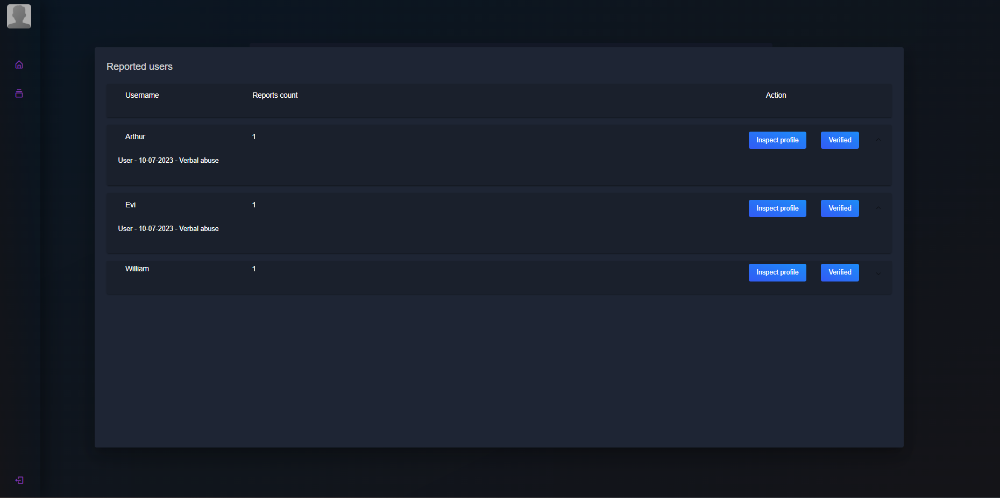

# TEAM FINDER
## INTRODUCTION
Team Finder is a project created to consolidate and expand my knowledge of application development using Java with the Spring framework.
## STATUS
The project is still under development, which means that it may have some shortcomings due to the fact that I am currently the only person testing it. I am also aware that some things can be done better, which is why I try to refactor it on an ongoing basis, along with my expanding knowledge (this applies to the version based on microservices, the monolith is no longer modified).

## TECHNOLOGY
### Backend
- Java 17
- Spring (Data, Security, AMQP etc.)
- Spring Boot
- Spring Cloud (Eureka, openfeign, gateway etc.)
- Hibernate
- PostgreSQL
- Kafka
- JUnit
- Mockito
- Maven
- SSE
- WebSocket

### Frontend
- Angular 13
- Angular Material
- WebSocket
- TypeScript
- Bootstrap
- HTML 5
- CSS 3

## PRESENTATION

### SCREENS FROM THE APP

#### USER PANEL

#### ADMIN PANEL

## FUNCTIONALITIES
The functionalities offered by the applications are briefly presented below
### AUTH
- Login
- Register
- Password change
- Email change
- Deletion of the account
- Email Verification (register, email change, deletion of the account)

### OTHER
#### ADMIN
- User verification (profile/chat logs)
- Ban/report management
- Group management (chat logs, active/deleted)

#### USER
- Own groups management:
  - Group removal
  - Public/private settings
  - Group leader change
  - Users removal
  - Data update
- Group chat
- Report system
- Other users profile view
- Profile management:
  - Data update
  - Profile picture change
  - Main ingame roles selection
  - Discord connection
- Group search
- Search results filter
- Group creation
- Friends management:
  - Addition
  - Private chats
- Notification management:
  - Friend requests acceptance/rejection
  - Read notifications removal

